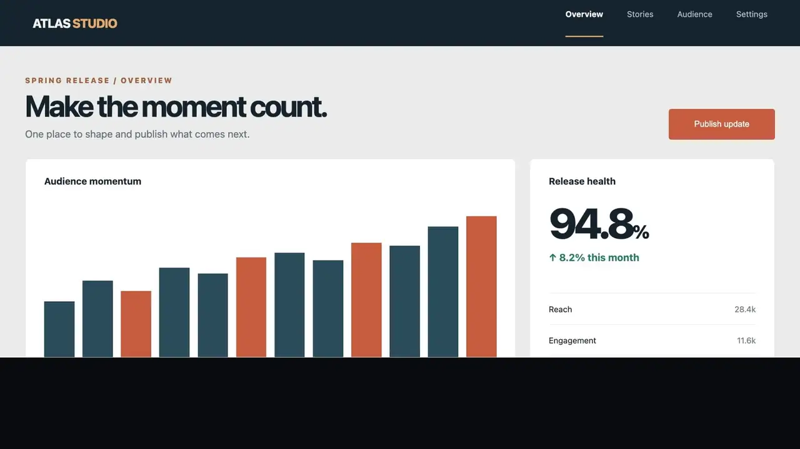

# vid2-gen

**The video CLI for coding agents.** Your agent writes a `timeline.json`, records your real app, pulls in generated images, and vid2 renders
a finished, loudness-mastered, QA-checked video with ffmpeg. No editor, no timeline UI: the edit is a file.

[](https://github.com/lidge-ai/vid2-gen/releases/latest)

*The launch video above was made with vid2 from [examples/vid2-launch](examples/vid2-launch) — real captures, ima2-gen stills, synthesized
music. [Full 30 s video](https://github.com/lidge-ai/vid2-gen/releases/latest).*

[](LICENSE) [](package.json) [](https://github.com/lidge-ai/vid2-gen/actions/workflows/ci.yml)

| You get | How |
|---|---|
| Real product footage | `vid2 capture web` (Chromium) and `capture native` record an action log next to the pixels; the camera zooms where you clicked and a synthetic cursor follows |
| Motion design without an editor | kinetic typography (word-by-word builds, magic move, inline icons, typing with accent decay), rebuilt UI (input field, bar chart, ticker, chips), sub-pixel camera moves, window cards, 30+ transitions including `zoomfrom` and `iris` |
| Sound that fits | synthesized music beds, sound effects anchored to cuts and clicks, voice ducking, two-pass loudness to −14 LUFS |
| Generated assets | optional [ima2-gen](https://github.com/lidge-ai/ima2-gen) images and Grok clips, cached so renders stay offline and repeatable |
| Proof, not vibes | `vid2 qa` writes a contact sheet, seam stills, loudness and black/freeze checks; `vid2 preview` renders any frame exactly |
| Agent-ready | JSON everywhere, typed exit codes, `vid2 capabilities`, six packaged Agent Skills, five templates |

## Install

Requires **Node.js 22.18 or newer** and **ffmpeg/ffprobe 6.1 or newer** on your PATH. ffmpeg 7.1+ is recommended. Install ffmpeg with `brew install ffmpeg` on macOS, `winget install Gyan.FFmpeg` on Windows, or your Linux distribution's package manager.

```bash
npm install -g vid2-gen
vid2 doctor
```

From a source checkout:

```bash
npm ci
npm run build
npm link
vid2 doctor
```

`vid2 doctor --json` returns machine-readable capabilities and exits 3 when required ffmpeg tools are missing or too old. `vid2 help --json` exposes commands and options for agents.

**Bun.** vid2 also runs under Bun (`bunx vid2-gen doctor`, `bun add -g vid2-gen`). CI checks that Bun renders frames identical to Node's, but it is not faster. On the 26-second [opus-astra-paper](examples/opus-astra-paper/README.md) film, Bun rendered in 55–57 s and Node in 54 s. The JS stage renderer ran at 51 fps under Bun and 64 fps under Node. Only startup is quicker (40 ms against 85 ms for `vid2 version`). Node 22.18+ remains the supported runtime. For faster renders, use `--hw-accel`.

## A 30-second timeline check

Save this as `timeline.json`:

```json
{
  "version": 1,
  "scenes": [
    {
      "id": "opening",
      "duration": "2s",
      "layers": [{ "type": "text", "text": "Meet the product" }]
    }
  ]
}
```

```bash
vid2 validate timeline.json --json
vid2 resolve timeline.json --json
vid2 schema --json
```

`validate` checks the schema and relationships, while `resolve` turns authored times into frames. The committed [JSON Schema](schema/timeline.v1.json) describes authored input; runtime validation also checks relationships such as source references and transition lengths.

## Render a timeline

```bash
vid2 render timeline.json -o intro.mp4 --profile proxy   # half size, fast
vid2 render timeline.json -o intro.mp4                   # final quality
vid2 compile timeline.json -o intro.plan.json            # inspect the ffmpeg plan
vid2 render timeline.json -o intro.mp4 --hw-accel if-possible   # hardware final encode when one works
vid2 doctor --hw                                         # which hardware encoders pass a trial encode
```

Each scene renders as its own cached segment, transitions are joined with exact frame math, and the output is checked with ffprobe (frame count, size, pixel format, faststart). Text uses libass with the bundled Geist, Geist Mono and Instrument Serif fonts (SIL OFL).

`--hw-accel` affects only the final encode: VideoToolbox, NVENC, QSV, AMF or VAAPI for H.264 and HEVC, and VideoToolbox for ProRes. vid2 trial-encodes five frames before trusting an encoder. `if-possible` falls back to software with a warning, and `required` exits 3. `--hw-encoder nvenc` limits the choice to one family, and render JSON reports `data.encoder`. On an M5 Pro, the 26-second 1080p [opus-astra-paper](examples/opus-astra-paper/README.md) film rendered in 34 s instead of 70 s. The file was a third of the size at VMAF 97.1 against the software render ([details](structure/render.md#hardware-encoding)).

## Kinetic launch films

A root `"look":{"preset":"film"}` gives the sequence a common finish; `riso` accepts a 2–6 color palette, and `paper` is another preset. A root HUD can carry a label, keyed counter, timecode and ticker across cuts and fades. Key and ticker times are absolute output positions, and only one HUD is allowed. The HUD is composited after the look, ordinary overlays and root effects so it stays legible. See the [look/HUD recipe](skills/vid2-timeline/references/recipes.md), [schema fields](skills/vid2-timeline/references/schema.md), and [direction references](skills/vid2-direction/SKILL.md).

0.2 adds a motion-graphics engine that draws each frame in JavaScript and hands ffmpeg a lossless alpha clip, so words, glyphs, icons
and UI pieces can move on their own. [examples/ima2-launch](examples/ima2-launch) is a 50-second launch film for ima2-gen built only with
it ([watch it](https://github.com/lidge-ai/vid2-gen/releases/tag/v0.2.0)); `vid2 init kinetic-launch` gives you a 30-second skeleton.

```json
{ "type": "kinetic", "size": 92, "accent": {},
  "states": [ { "at": "0.1s", "text": "Anything you can do in a {globe} browser" },
              { "at": "2.2s", "text": "{globe} browser" } ] }
{ "type": "field", "grow": {}, "cursor": { "from": { "x": 1500, "y": 860 }, "at": "0.5s", "click": "0.6s" },
  "typing": [ { "at": "0.9s", "text": "a cat astronaut, 35mm film" } ] }
{ "type": "bars", "items": [ { "label": "ours", "value": 12, "highlight": true }, { "label": "theirs", "value": 1 } ], "max": 12, "unit": "" }
```

| Layer | What it does |
|---|---|
| `kinetic` | token states: words rise/blur/pop in, glyphs type/drop/scramble, words shared by the next state glide there (magic move), `{icon}` tokens, accent decay, reading highlight, pill, camera follow, `expand` an icon to the frame |
| `field` | input pill that grows as you type, caret, synthetic cursor with click ripple, masking |
| `bars`, `ticker`, `chips` | bar chart with count-up and glow; slot-machine list with icons; pills with connector lines |
| `stage` | raw nodes (text, image, rect, group) with keyframes and springs, for anything the presets don't cover |

With `audio.autoCues: true` the animation drives the sound: typing ticks, pops, clicks, a riser that ends when an expand fills the frame.
`vid2 qa` checks the contrast of stage text too. The [kinetic grammar](skills/vid2-direction/references/kinetic-grammar.md) in the
direction skill explains the rules the defaults follow. See [structure/stage.md](structure/stage.md).

## Capture your real app

```bash
vid2 capture web --url http://localhost:3000 --steps flow.json --out demo      # Chromium, action log + footage
vid2 capture native --display 0 --duration 10 --out desk                        # macOS screen via ffmpeg
```

Every capture keeps an action log (clicks, typing, marks) next to the footage. A timeline can then say `"camera": {"auto": "events"}`
to zoom where things happen, draw a smooth synthetic cursor, or cue a sound on `{"event": "buy"}`. Typed text is redacted unless you pass
`--record-text`. See [structure/capture.md](structure/capture.md).

## Generated assets (optional ima2-gen)

```json
"sources": { "hero": { "type": "generate", "provider": "ima2", "kind": "image", "prompt": "a glowing film strip" } }
```

`vid2 assets resolve timeline.json` (or `vid2 render --generate`) asks a running [ima2-gen](https://github.com/lidge-ai/ima2-gen) for images
and Grok video clips once and caches them; renders stay offline and repeatable. See [structure/assets.md](structure/assets.md).

The [generated-video example](examples/generated-video/README.md) puts a five-second Grok clip on a seven-second layer; the final two seconds hold its last frame and produce one `W_GENERATED_CLIP_HOLD` warning. Its offline twin uses a local clip with the `file` provider. Video options are checked before an ima2 request: duration 1–15 seconds, supported resolution and aspect ratio, and readable image references. `seedImage` and `referenceImages` are exclusive; references cap resolution at 720p. The [assets contract](structure/assets.md) lists the full guard and platform limits.

## Sound

```json
"beat": { "bpm": 120 },
"audio": { "music": { "synth": { "preset": "launch" } }, "cues": [{ "at": "2b", "sfx": "preset:impact" }] }
```

vid2 synthesizes a music bed and sound effects with ffmpeg alone, places whooshes on transitions and clicks on captured clicks, ducks music
under voice-over, and masters to −14 LUFS. ElevenLabs and a local ACE-Step server are optional (`vid2 audio generate`). See
[structure/audio.md](structure/audio.md).

## Commands and delivery

| Command | Purpose |
|---|---|
| `doctor`, `schema`, `validate`, `resolve`, `help`, `version` | Discover tools, inspect the contract, and validate or resolve timelines |
| `compile`, `render` | Compile a timeline to an ffmpeg plan (with stage clips) and render it |
| `capture` | Record web (Chromium), Electron, native screen and terminal footage with an action log |
| `audio` | Beat detection, synth beds, SFX, provider audio; mixing and mastering happen in `render` |
| `assets` | Generate images and Grok clips through ima2-gen (optional), cached by request |
| `preview`, `qa`, `probe` | Frames through the real composition; evidence report (contact sheet, seams, loudness, black/freeze, contrast) |
| `analyze`, `review` | Shot, color, motion and DSP analysis; optional frame review and audio listening |
| `init`, `skill`, `capabilities` | Templates, packaged agent skills, one-call capability summary (layers, icons, transitions) |

Every command and subcommand answers `--help` with its arguments, options (value names and defaults) and examples, for example
`vid2 render --help` or `vid2 audio beats --help`; `vid2 help audio beats` prints the same text.

The intended flow is **capture → author one timeline → resolve assets → compile → render → QA**. Rendering uses ffmpeg locally; generated assets remain optional. The [structure guide](structure/INDEX.md) explains module boundaries and the public CLI contract.

## For coding agents

```bash
vid2 skill install --agent codex      # or --agent claude, --dir <path>, --tmp
vid2 init kinetic-launch my-video     # kinetic-launch, launch-teaser, feature-demo, changelog, social-vertical
vid2 preview my-video/timeline.json --at 0,50%,drop --placeholders
vid2 render my-video/timeline.json --profile proxy --placeholders -o proxy.mp4
vid2 qa proxy.mp4 --timeline my-video/timeline.json
```

The packaged skills teach the loop (validate → preview stills → proxy → qa → final), the timeline contract, directing defaults with concrete
replacements for common clichés, capture, audio and ima2 recipes.

To revise a finished cut from evidence:

```bash
vid2 render timeline.json -o film.mp4
vid2 analyze film.mp4 --timeline timeline.json --json
VID2_REVIEW_AUDIO_BASE_URL=http://127.0.0.1:10100 VID2_REVIEW_AUDIO_MODEL=audio-model \
  vid2 review film.mp4 --timeline timeline.json --base-url http://127.0.0.1:10100 --model image-model --listen --json
# Fix the timeline from review.json and analyze/report.json, then render again.
```

Model calls are opt-in. Image review needs `--base-url`/`--model` or `VID2_REVIEW_BASE_URL`/`VID2_REVIEW_MODEL`; `VID2_REVIEW_API_KEY` is optional. Listening needs `--listen` plus `VID2_REVIEW_AUDIO_BASE_URL` and `VID2_REVIEW_AUDIO_MODEL`; `VID2_REVIEW_AUDIO_API_KEY` is optional. Hosts are bare origins, with `/v1` accepted. Without an image model, review writes evidence and returns `SKIPPED` with exit 0. DSP owns loudness, low end and sync; listener feedback is useful for timbre, groove, arrangement and mood, but weak on sub-bass. See [the QA contract](structure/qa.md).

Use `vid2 help --json` to discover the current command set, `vid2 schema --json` to obtain the timeline contract, and `vid2 validate <file> --json` before later render steps. JSON mode prints one result object to stdout; diagnostics go to stderr. Exit codes distinguish input errors, missing capabilities, access/provider failures, rendering, QA, and interruption.

## Why ffmpeg?

ffmpeg runs locally, supports frame-based composition across platforms, and can be probed for exact filters and encoders before a render. vid2 keeps the timeline declarative and reports missing capabilities instead of silently changing an effect. You install ffmpeg separately; it is not bundled into the npm package.

## Contributing and security

See [CONTRIBUTING.md](CONTRIBUTING.md) for development and tests. Report vulnerabilities privately through [GitHub Security Advisories](https://github.com/lidge-ai/vid2-gen/security/advisories/new); see [SECURITY.md](SECURITY.md). Licensed under [MIT](LICENSE).
